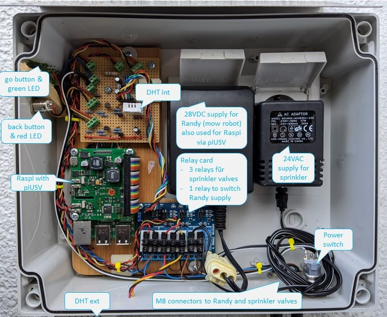

# Garden automation using a Raspberry pi
The Raspberry pi in this project controls a Gardena mowing robot (called __Randy__) by switching off its power supply. If the power supply is off, Randy doesn't leave its changing stating. Randy is off-duty, if the weather forecast is bad (taken from http://api.openweathermap.org/).

As a second job, three sprinklers are controlled by the Raspi via relays switching 24VAC to the sprinkler valves.

